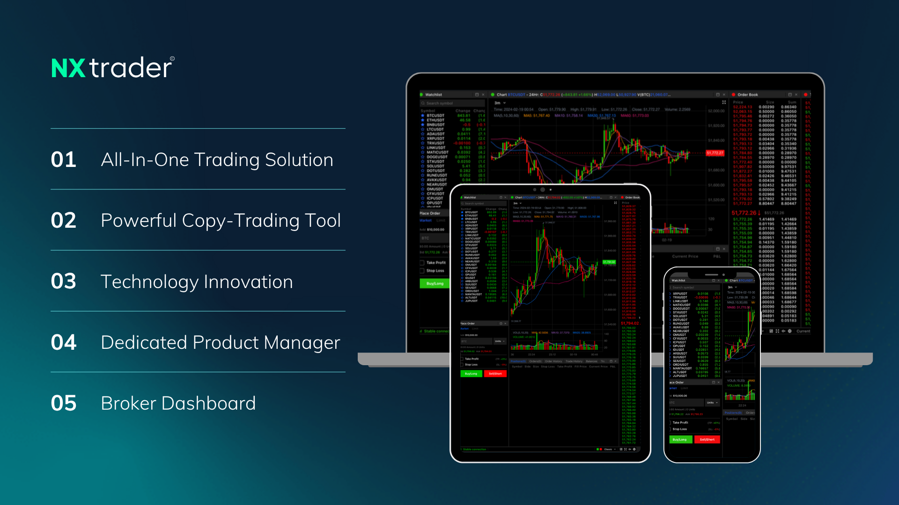
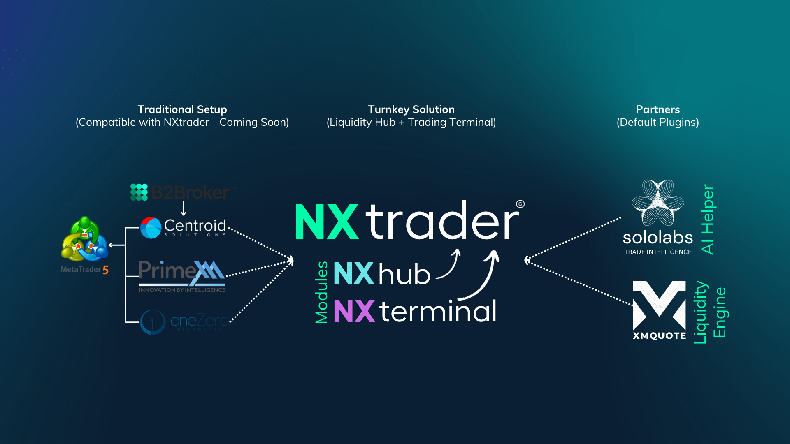
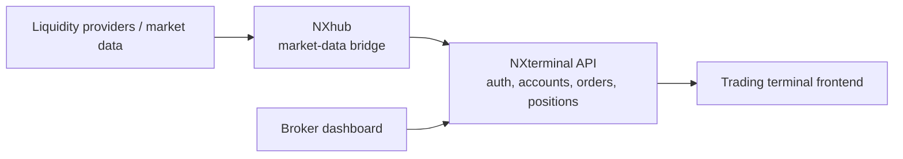

  

# NXtrader

**NXtrader** is a turnkey trading platform for brokers: a liquidity hub and a trading terminal that work together, with copy-trading and a broker dashboard on top.

This repository is the entry point. It describes the platform and links to the components that are published as open source reference code.

## What the platform offers

1. **All-in-one trading solution**: liquidity hub plus trading terminal in one package.
2. **Copy-trading tool**: follow and mirror other traders' positions.
3. **Technology innovation**: market-data bridging, plugin-based liquidity and AI helpers.
4. **Dedicated product manager** for broker onboarding.
5. **Broker dashboard** for account and order oversight.

## Architecture

  

- **Traditional setup (compatible, coming soon):** brokers running MetaTrader 5 with their existing liquidity and bridge vendors can connect to NXtrader.
- **Turnkey solution:** two modules, **NXhub** (liquidity hub) and **NXterminal** (trading terminal).
- **Partners (default plugins):** an AI helper and a liquidity engine plug into the platform.

## Published components

| Component | Repository | What it is |
|---|---|---|
| NXhub | [`nxhub-liquidity-bridge`](https://github.com/zinxer/nxhub-liquidity-bridge) | Market-data bridge: Express, WebSocket, Sequelize, MySQL |
| NXterminal API | [`nxterminal-api`](https://github.com/zinxer/nxterminal-api) | Backend API: auth, users, trade accounts, orders, positions, broker routes |
| Trading terminal | [`daxtrader`](https://github.com/zinxer/daxtrader) | Next.js frontend: Chakra UI, klinecharts |

Other parts of the platform (copy-trading engine, broker dashboard, core services) are not part of this open-source set.

## Notes

- All code is reference code and has **not been audited**. Run the services behind network-level protection.
- Credentials, client data and customer-specific workflows have been removed from these repositories; configuration is supplied through environment variables (see each component's `.env.example`).
- The images in `docs/` are NXtrader marketing material. The MIT license below covers the text of this repository, not the images or the third-party logos shown in them, which belong to their respective owners.

## License

MIT for the text in this repository. See [LICENSE](LICENSE).
